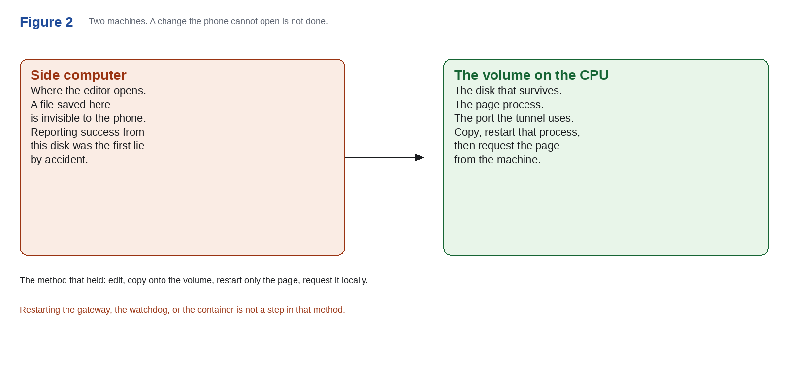
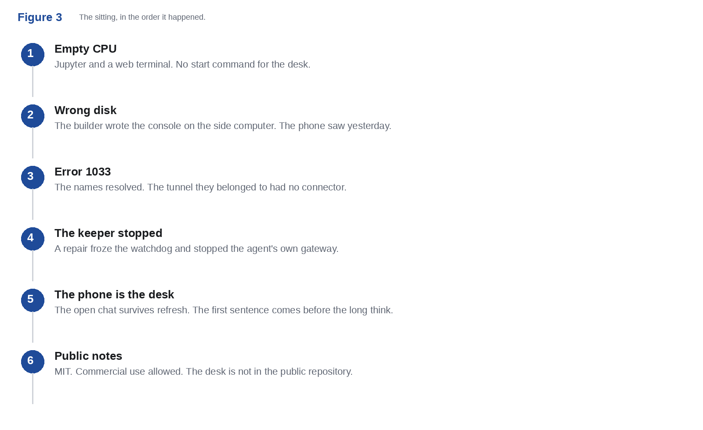

# 23 September 2026

One sitting. A rented CPU that started as Jupyter. A light desk by the end of it. These are the files.

## Working paper

**Testing Grok Build on a rented CPU.** GP-2026-01.

[Open the PDF](grok-build/galion-gp-2026-01.pdf) · [Read it on the door](https://developer.galion.app/p/grok-build-paper)

What was created, how it was put on the machine, where the work stands, and how Grok Build behaved. Early score and late score. Not a benchmark.

## Notes

| Note | What it is |
| --- | --- |
| [ald-gaa](ald-gaa) | The gate-all-around research plan. A plan, not a replacement claim. |
| [ald-gaa-live](ald-gaa-live) | The follow-up that says the plan is public. |
| [grok-build-note](grok-build-note) | The short public note. Four scenes. |
| [grok-build](grok-build) | The paper, the figures, and the text. |

## License

[MIT](../LICENSE). Commercial use is allowed. Keep the notice.
