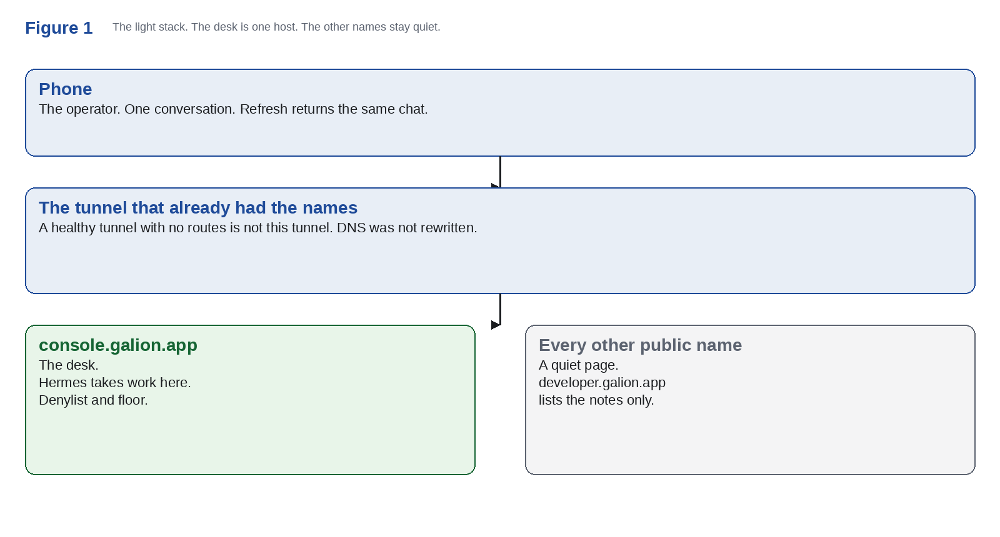
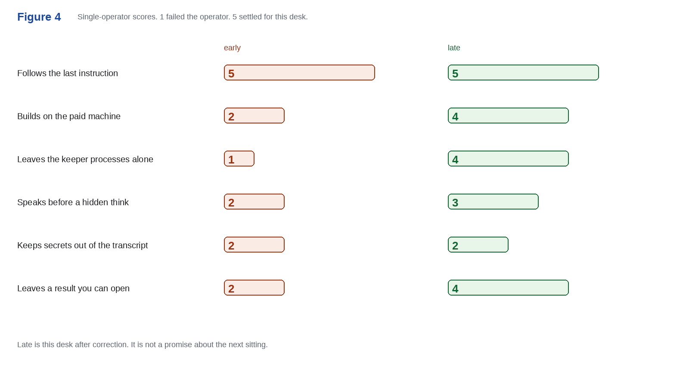

# Galion Studio

Public notes, filed by the day they were written.

The license is [MIT](LICENSE). Commercial use is allowed. Keep the copyright notice and the permission notice with every copy.

The desk is not in this repository. Neither is the private tree.

## Review · 23 September 2026

**Testing Grok Build on a rented CPU.** One sitting. One operator. Not a benchmark.

[Read the paper](https://developer.galion.app/p/grok-build-paper) · [PDF](2026-09-23/grok-build/galion-gp-2026-01.pdf) · [Studio page](https://github.com/galion-studio)

**Grade.** Useful. Not finished. Not something to leave alone for a week. Not a Grok-class computer.

It will patch the machine in the same hour, and it will follow a bad last instruction with the same energy. Told to fix the desk, it once stopped the process that was serving it. The early scores are that failure. The late scores are after the operator corrected it. Late is not a forecast.

| Behavior | Early | Late |
| --- | ---: | ---: |
| Follows the last instruction | 5 | 5 |
| Builds on the paid machine | 2 | 4 |
| Leaves the keeper processes alone | 1 | 4 |
| Speaks before a hidden think | 2 | 3 |
| Keeps secrets out of the transcript | 2 | 2 |
| Leaves a result you can open | 2 | 4 |

The other two figures, and the prose, are in [the paper](2026-09-23/grok-build/galion-gp-2026-01.pdf).

## The same day

| Note | Read | Folder |
| --- | --- | --- |
| The layer that wraps everything | [door](https://developer.galion.app/p/ald-gaa) | [2026-09-23/ald-gaa](2026-09-23/ald-gaa) |
| The ALD plan is live | [door](https://developer.galion.app/p/ald-gaa-live) | [2026-09-23/ald-gaa-live](2026-09-23/ald-gaa-live) |
| Testing the Grok Build computer | [door](https://developer.galion.app/p/grok-build) | [2026-09-23/grok-build-note](2026-09-23/grok-build-note) |
| Working paper GP-2026-01 | [PDF](2026-09-23/grok-build/galion-gp-2026-01.pdf) | [2026-09-23/grok-build](2026-09-23/grok-build) |

The research plan on rare-earth oxides is a plan. It does not claim those oxides replace the usual dielectric.

## How the files are kept

Each day is a folder, `YYYY-MM-DD`. `publish/` keeps the same files at stable paths, so an older link still opens.

The board is [Discussions](https://github.com/galion-studio/community/discussions). The door is [developer.galion.app](https://developer.galion.app).
